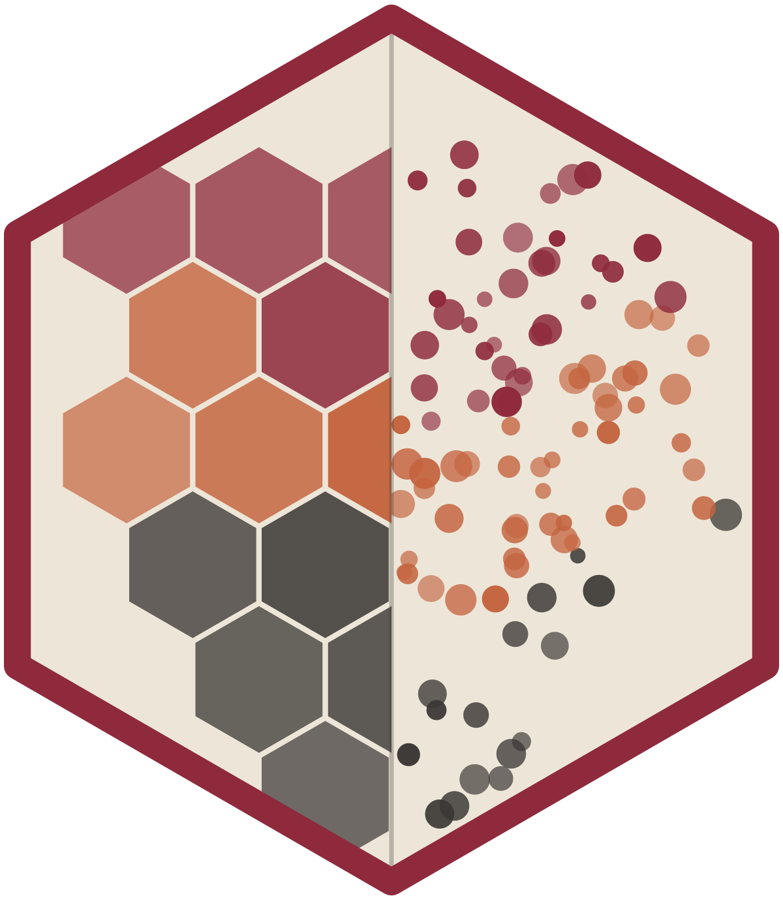

# plotomics



[](https://doi.org/10.5281/zenodo.21926306)

**Lightweight, GPU-accelerated bioinformatics visualization components with R and Python wrappers.**

One high-performance TypeScript core, wrapped for R (via
[htmlwidgets](https://www.htmlwidgets.org/)) and Python (via
[anywidget](https://anywidget.dev/)). Built for **large datasets**: the
rendering layer is WebGL/canvas throughout (regl, canvas, sigma, igv.js,
Gosling.js), and numeric data reaches the browser as a binary buffer rather than
JSON, so hundreds of thousands to millions of features stay interactive.
Components are designed to be **publication-ready**, not toy demos.

## Installation

R, from CRAN:

```r
install.packages("plotomics")
```

Python, from PyPI:

```bash
pip install plotomics
```

See [pkg-r/README.md](pkg-r/README.md) and [pkg-py/README.md](pkg-py/README.md)
for the full quick start in each language.

## Motivation

I kept hitting the same wall. Omics data outgrew the plotting stack that I
used to draw it. A 500,000-cell embedding or a 20,000-gene volcano plot is
common work today, but most plotting tools were built for a few thousand
marks. Past that count, rendering slows down, and the figure stops being
readable before the data stops being interesting.

A second problem had nothing to do with size. My work runs on both R and
Python, so the same figure gets built twice: once in R, once in Python. The
two copies drift apart. I draw a heatmap in R and a different one in a
Python notebook, and I cannot say which one is correct without reading both.

So I wrote each component once, in TypeScript, and wrapped it thinly for
both languages. This gives me:

- GPU or canvas rendering with binary data transport.
- Real SVG and PNG export instead of a screenshot.
- The same object in a Jupyter notebook, a Shiny app, the RStudio Viewer,
  Quarto, or a plain web page.

plotomics is not a general plotting library by design. For a small, static
figure, better tools already exist. [docs/motivation.md](docs/motivation.md)
covers the full goals and non-goals. It also covers how plotomics compares
with ComplexHeatmap, maftools, survminer, Seurat, and scanpy, and when to
use one of those instead.

## Components

Seventeen components, each available in all three languages. The R constructor
is snake_case (`oncoplot()`), the Python class is PascalCase (`Oncoplot`), and
the JS factory is `createOncoplot`.

The **Figure** column names the thing you would call it in a paper, so you can
find the component by the figure you already have in mind. The **Engine** column
is the actual library doing the drawing, not a category. The **Scale** column is
the synthetic size the dev harness drives, which is what each component is built
and exercised for, not a benchmark and not a ceiling.

| Component | Figure it produces | Engine | Scale exercised |
|---|---|---|---|
| Volcano plot ✅ reference | Volcano: log2 fold change vs. −log10 p, threshold guides, top-N labels | `regl-scatterplot` (WebGL point sprites), `d3-scale` | 200k points |
| Expression heatmap | Sample × gene matrix, optional row z-score | `regl` (WebGL, matrix as a float texture sampled in a shader) | 1000 × 1000 = 1M cells |
| Clustered heatmap | Clustered heatmap with dendrograms, the `seaborn.clustermap` / Morpheus layout | canvas 2-D `ImageData`, one pixel per cell then scaled; `ml-hclust` for linkage; SVG dendrograms | 120 × 60 |
| Marker gene dot plot | Dot plot, the `scanpy sc.pl.dotplot` / Seurat `DotPlot()` figure | canvas 2-D + SVG | features × groups |
| Stacked violin | Stacked violin panel, `scanpy sc.pl.stacked_violin` / Seurat `VlnPlot()` | canvas 2-D + SVG; densities estimated upstream | scales with the density grid, not cells |
| Embedding | UMAP, t-SNE and PCA score plots, with lasso selection | `regl-scatterplot` (WebGL point sprites), `d3-scale` | 150k harness, 500k in the example below |
| Spatial tissue map | Visium-style spot map over the H&E section | canvas 2-D, one arc per spot, shared image/spot fit | ~4k spots (Visium scale, **not** Xenium) |
| Oncoplot (OncoPrint) | OncoPrint: gene × sample alteration classes with burden and frequency margins, the `maftools` / cBioPortal figure | canvas 2-D grid + SVG labels | 60 × 1,200 = 72k cells |
| Protein domain lollipop | Lollipop, also called a mutation needle plot, over Pfam/InterPro domains | canvas 2-D + SVG | hundreds to thousands of variants |
| Kaplan-Meier curve | KM survival curves, censoring ticks, CI bands, number-at-risk table | canvas 2-D + SVG; fit from `survival` / `lifelines` | a handful of strata |
| Categorical profile | SBS96 mutational signature profile, six substitution-class blocks | canvas 2-D + SVG | 96 contexts, up to a few thousand bins |
| UpSet plot | UpSet: intersection bars over a membership matrix | canvas 2-D + SVG; exclusive intersections computed in R | dozens of sets |
| Gene treemap | Treemap of gene sets and pathway composition | canvas 2-D + `d3-hierarchy` (squarified layout) | 60k leaves |
| Network graph | Force-directed PPI, co-expression and regulatory graphs | `sigma` v3 (WebGL) + `graphology` + `graphology-layout-forceatlas2` | 5k nodes |
| Hi-C contact matrix | Hi-C / Micro-C contact maps | `regl` (WebGL) with a level-of-detail pyramid, no tile server | 1024 × 1024 ≈ 1M bins |
| Genome viewer (igv.js) | Track browser: BAM, BigWig, VCF, BED, refGene | `igv.js`, streams and tiles internally | whole genome, server-streamed |
| Genome viewer (Gosling) | Declarative genomics figures: circos, ideograms, linked views | `gosling.js` on `PIXI.js` (WebGL) | whole genome, per spec |

Note that `clustermap` and `heatmap` look alike and are built differently: the
first is a scaled 2-D canvas, the second a WebGL texture. Not every large figure
needs a shader, and what actually matters is that no component uses per-datum DOM.

Three components ship data helpers that run the statistics in R, where you can
see them, rather than inside the renderer: `oncoplot_memo_sort()`,
`upset_intersections()` and `violin_density()`.

### A million cells, concretely

Cell centroids from a 1M-cell Xenium run go through `embedding`. Points become
WebGL sprites drawn from GPU buffers, and the coordinates arrive from Python as a
`Float32Array` buffer: two million float32s is 8 MB of binary handed to the GPU,
against roughly 40 MB of JSON text that would otherwise be parsed first.

What that path does not give you is the H&E underlay. `spatial` is the component
that puts measurements on the image, and it draws one canvas arc per spot, sized
for Visium-scale slides. Registering a million single cells onto the histology is
not something it does today. That is a genuine limitation, not an oversight to
work around.

**Could plotly not do this?** For the scatter, largely yes.
`plotly.js` has a WebGL trace, `scattergl`, and it will draw a million points;
anyone claiming otherwise is describing the default SVG `scatter` trace, which
emits one DOM node per point. The honest differences are narrower: plotly's R and
Python bindings serialise coordinates as JSON where plotomics ships a binary
buffer; the domain figures here (an oncoprint with margins, a KM with an aligned
risk table, an UpSet matrix, an SBS96 profile) are each a substantial custom build
in plotly and one call here; and plotly's R and Python APIs are separate surfaces
that drift, where both wrappers here pack one payload for one renderer. Against
that, plotly is far more general and more mature. See
[docs/motivation.md](docs/motivation.md) for where an established package should
win.

## Repository layout

```text
pkg-js/
  core/         plotomics/core        contract, theme, color, binary transport, export
  components/   plotomics  the headless viz factories + adapters + dev harness
pkg-r/          R package (htmlwidgets)
pkg-py/         Python package (anywidget)
docs/           landing page, architecture notes, motivation
examples/       runnable Shiny and shiny-react apps
scripts/        sync built bundles into the wrappers
.github/        CI, docs and release workflows
```

## Quick start (dev)

```bash
pnpm install
pnpm dist        # build all JS + copy bundles into pkg-r/ and pkg-py/

# Visual dev harness (WebGL, synthetic data at scale)
pnpm --filter plotomics dev   # http://localhost:5180
```

### R

Make sure the bundles are synced first, from the shell:

```bash
pnpm dist
```

Then, in R:

```r
devtools::load_all("pkg-r")
df <- data.frame(x = rnorm(1e5), y = abs(rnorm(1e5)) * 3, label = paste0("GENE", 1:1e5))
volcano(df, fc_threshold = 1, p_threshold = 0.05)
```

### Python

```python
import numpy as np, pandas as pd
from plotomics import Volcano

n = 200_000
df = pd.DataFrame({"x": np.random.randn(n), "y": np.abs(np.random.randn(n))*3,
                   "label": [f"GENE{i}" for i in range(n)]})
Volcano(df)
```

Large single-cell embedding (UMAP/t-SNE) colored by cluster, with lasso selection:

```python
import numpy as np, pandas as pd
from plotomics import Embedding

n = 500_000
k = np.random.randint(0, 8, n)                        # cluster per cell
df = pd.DataFrame({"x": np.random.randn(n) + k*4, "y": np.random.randn(n) + k*4,
                   "color": [f"cluster {i}" for i in k]})
Embedding(df, color_mode="categorical")
```

## Examples

Two runnable apps, each with its own README:

- [examples/r-shiny](examples/r-shiny) is a gallery app on the classic Shiny
  path, using the `<name>Output()` / `render<Name>()` bindings.
- [examples/shiny-react-embedding](examples/shiny-react-embedding) drives the
  headless factory directly from a React frontend, with no htmlwidgets and no
  anywidget in between.

## Contributing

New components follow one recipe, described in
[CONTRIBUTING.md](CONTRIBUTING.md). The Volcano plot is the reference
implementation. Architecture details are in
[docs/architecture.md](docs/architecture.md).

## Citation

If plotomics contributed to work you are publishing, please cite it:

> Bharti, S. plotomics: High-Performance Bioinformatics Visualizations. Zenodo.
> [10.5281/zenodo.21926306](https://doi.org/10.5281/zenodo.21926306)

```bibtex
@software{bharti_plotomics,
  author  = {Bharti, Samuel},
  title   = {plotomics: High-Performance Bioinformatics Visualizations},
  year    = {2026},
  publisher = {Zenodo},
  doi     = {10.5281/zenodo.21926306},
  url     = {https://github.com/samuelbharti/plotomics}
}
```

That DOI always resolves to the newest release. Zenodo also mints one per
version, so use the version-specific DOI from the record if you need to pin the
exact release you ran. [CITATION.cff](CITATION.cff) carries the same metadata in
machine-readable form, and GitHub's "Cite this repository" button reads it.

## Acknowledgements

Barret Schloerke and Carson Sievert advise this work as thesis advisors.
Posit Software, PBC funded early work on this package and holds copyright
together with the author.

## License

MIT
