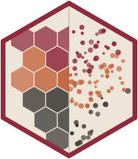

# plotomics 

<!-- badges: start -->
[](https://github.com/samuelbharti/plotomics/actions/workflows/ci.yml)
[](https://samuelbharti.r-universe.dev/plotomics)
[](https://opensource.org/licenses/MIT)
<!-- badges: end -->

Seventeen GPU- and canvas-accelerated visualization widgets for bioinformatics,
built on a shared JavaScript core and exposed to R through
[htmlwidgets](https://www.htmlwidgets.org). Every widget renders in the RStudio
Viewer, R Markdown, Quarto and Shiny, and each ships a matching
`*Output()` / `render*()` pair for Shiny apps.

The same core drives the Python and JavaScript packages, so a figure looks and
behaves identically in all three languages.

## Installation

``` r
install.packages("plotomics", repos = "https://samuelbharti.r-universe.dev")
```

Or from GitHub:

``` r
# install.packages("pak")
pak::pak("samuelbharti/plotomics")
```

## Quick start

``` r
library(plotomics)

# Differential expression
volcano(data.frame(
  x    = res$log2FoldChange,
  y    = -log10(res$padj),
  gene = rownames(res)
))

# A single-cell embedding: a factor pins the legend order and keeps
# unused levels, the way drop = FALSE does in ggplot2
embedding(data.frame(
  x     = umap[, 1],
  y     = umap[, 2],
  color = factor(cell_type)
))

# Kaplan-Meier, straight from a survfit object
km(survival::survfit(survival::Surv(time, status) ~ sex, data = lung))
```

## Components

| Area | Functions |
| --- | --- |
| Expression and abundance | `volcano()`, `bioheatmap()`, `clustermap()`, `dotplot()`, `violin()` |
| Single-cell and spatial | `embedding()`, `spatial()` |
| Cohort and variant | `oncoplot()`, `lollipop()`, `km()`, `bioprofile()` |
| Sets, hierarchies, networks | `upset()`, `treemap()`, `network()` |
| Genome and chromatin | `hic()`, `igv()`, `gosling()` |

Helpers: `oncoplot_memo_sort()` for the conventional oncoplot column order,
`upset_intersections()` for exclusive set intersections, and
`violin_density()` for densities computed in R.

Two names differ from the obvious choice, so that attaching the package masks
nothing in base or the recommended packages: `bioheatmap()` rather than
`heatmap()`, and `bioprofile()` rather than `profile()`. Both have
`*_plotomics()` aliases (`heatmap_plotomics()`, `profile_plotomics()`).

## Shiny

Every widget has a Shiny pair. The network and embedding widgets also report
selections back to the server:

``` r
ui <- fluidPage(networkOutput("net"))

server <- function(input, output) {
  output$net <- renderNetwork(network(nodes, edges))
  # clicking a node sets input$net_selected
  observeEvent(input$net_selected, print(input$net_selected))
}
```

## Built for large data

Numeric columns reach the browser as a binary buffer rather than JSON, which is
what keeps several hundred thousand points interactive rather than merely
drawable.

## Documentation

- [Reference](https://www.samuelbharti.com/plotomics/r/reference/) for every function
- [Changelog](https://www.samuelbharti.com/plotomics/r/news/)
- [Project overview](https://www.samuelbharti.com/plotomics/), including the
  Python and JavaScript packages

## License

MIT. See [LICENSE](LICENSE).
